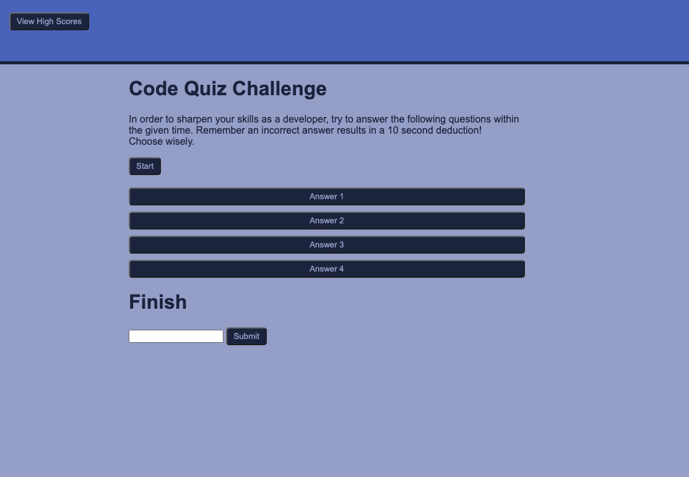

# Code Quiz

## Description
A timed quiz on JavaScript fundamentals that stores high scores for user to guage progress

When the start button is clicked the game will begin.
When either all questions are answered or the time runs out, the game is over. Then the user can save score and initials. 

## Technologies

## Site Preview

## Deployed
[CodeQuiz](https://sidoniag.github.io/code_quiz/)
## Questions
Visit my [github](https://github.com/sidoniag) 
Questions here: <seekersig@gmail.com>

